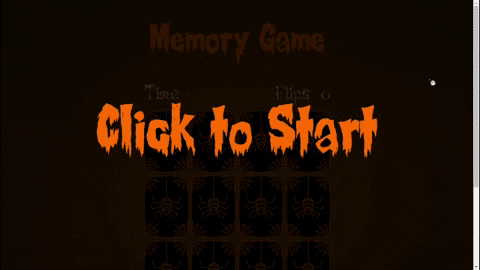

# memory-game-js 
Esse é um jogo da memória com um tema de Halloween feito com HTML5, CSS3 e Javascript  Você pode ver o <strong>resultado final</strong> logo abaixo :arrow_heading_down:

## Resultado final :clipboard:
### Jogo online: https://tiagodiass.github.io/memory-game-js

 

